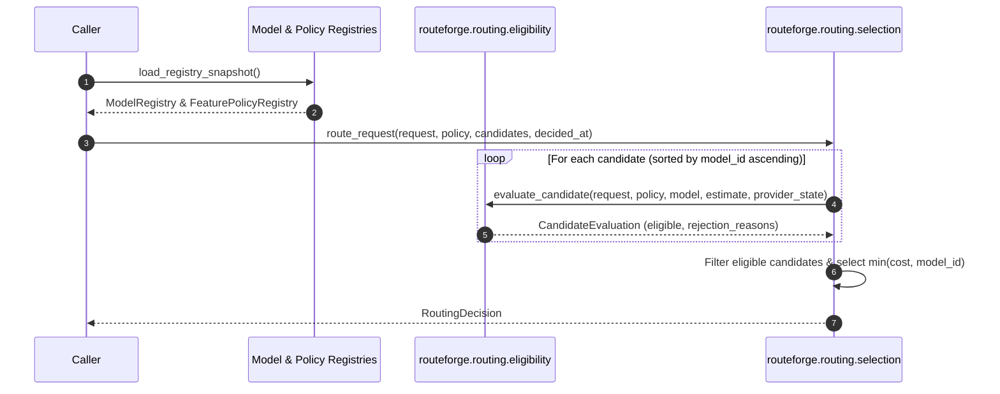

# Current Request Flow

## Overview

This document describes the in-memory candidate evaluation and request routing flow currently implemented in Milestone M1 (`Implemented in M1`).

## M1 Execution Flow

In M1, routing logic executes synchronously in memory without network calls, database lookups, or live provider invocation:

```text
Normalized ChatRequest
        ↓
FeaturePolicy (loaded from FeaturePolicyRegistry)
        ↓
Candidate Models (loaded from ModelRegistry)
        ↓
CandidateEstimate (caller-supplied test fixture per model)
        ↓
ProviderOperatingState (caller-supplied test state per model)
        ↓
evaluate_candidate() called for every candidate model
        ↓
Tuple of CandidateEvaluation records (rejection reasons in stable order)
        ↓
route_request() selects lowest-cost eligible candidate
        ↓
Immutable RoutingDecision returned
```

## Sequence Diagram



## Detailed Flow Steps (`Implemented in M1`)

1. **Request Normalization:** `ChatRequest` arrives as a typed domain contract with explicit `request_id`, `team_id`, `feature_id`, `messages`, `output_format`, `routing_constraints`, and UTC timestamp.
2. **Policy & Model Resolution:** `FeaturePolicy` and `ModelDefinition` entities are fetched from `InMemoryFeaturePolicyRegistry` and `InMemoryModelRegistry` (loaded from UTF-8 JSON files in `config/`).
3. **Fixture Estimates & Provider States:** For each candidate model, the caller constructs explicit `CandidateEstimate` values (`predicted_quality`, `estimated_latency_ms`, `estimated_cost_usd`) and `ProviderOperatingState` (`HEALTHY`, `DEGRADED`, or `UNAVAILABLE`).
4. **Deterministic Evaluation:** `route_request` materializes candidates and sorts them by `model_id` ascending. It calls `evaluate_candidate` for every candidate to enforce:
   - **Model Permission:** Checked against enabled status, `allowed_model_ids`, and `pinned_model_id`.
   - **Required Capabilities:** Union of policy requirements, request constraints, and `STRUCTURED_OUTPUT` for JSON output format.
   - **Quality Threshold:** `estimate.predicted_quality >= max(policy.minimum_quality, request.minimum_quality)`.
   - **Latency Limit:** `estimate.estimated_latency_ms <= min(policy.maximum_latency_ms, request.maximum_latency_ms)`.
   - **Cost Limit:** `estimate.estimated_cost_usd <= min(policy.maximum_cost, request.maximum_cost)`.
   - **Governance Compatibility:** Request governance allowed by model AND `<= policy.maximum_governance_classification`.
   - **Provider Operating State:** Checks for `UNAVAILABLE` and `DEGRADED` permissions.
5. **Rejection Reason Audit:** Any failing candidate accumulates explicit rejection reasons in strict stable order (`MODEL_NOT_ALLOWED`, `CAPABILITY_MISMATCH`, `QUALITY_BELOW_THRESHOLD`, `LATENCY_ABOVE_TARGET`, `COST_ABOVE_REQUEST_LIMIT`, `GOVERNANCE_MISMATCH`, `PROVIDER_UNAVAILABLE`, `DEGRADED_STATE_NOT_ALLOWED`).
6. **Lowest-Cost Selection:** Eligible candidates are sorted by `(estimated_cost_usd ascending, model_id ascending)`.
7. **Reason Code Determination:**
   - `NO_ELIGIBLE_MODEL`: When no candidates are eligible.
   - `POLICY_PINNED_MODEL`: When selected model equals `policy.pinned_model_id`.
   - `DEGRADED_MODE_SELECTION`: When selected model's provider is `DEGRADED`.
   - `CHEAPEST_ELIGIBLE_MODEL`: Standard cost-optimized selection.
8. **Decision Output:** Returns an immutable `RoutingDecision` capturing the selection, decision timestamp, and full tuple of `CandidateEvaluation` records. Provider execution is NOT performed.

## Planned V1 Extensions (`Planned for later V1 milestones`)

In future milestones, this core flow will be wrapped inside a complete data-plane pipeline:
* **M2.1 & M2.2 (`Implemented in M2`):** FastAPI application factory, `/healthz` endpoint, gateway wire models, API-to-domain translation, gateway candidate estimation, and functional `POST /v1/chat/completions` endpoint backed by `DeterministicMockProvider`.
* **M3/M4:** Database-backed registry lookups and Redis rate-limit checks.
* **M5:** Automated candidate estimate generation from historical latency samples and quality profiles.
* **M7:** Execution of the selected candidate through vendor provider adapters (`LLMProvider.complete`).
* **M8:** Retries and fallback execution upon provider failure.
* **M9:** Asynchronous post-execution quality verification workers.
