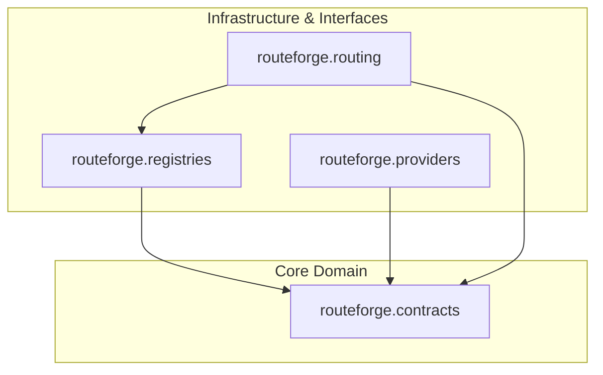

# Module Boundaries and Dependency Rules

## Overview

RouteForge is built as a Python modular monolith in `src/routeforge`. Core domain contracts remain isolated from external web frameworks, database drivers, and vendor SDKs (`AGENTS.md` Rule 5, 7, 8).

## Implemented Modules and Boundaries (`Implemented in M1`)

### 1. Contracts (`src/routeforge/contracts/`)

**Responsibilities:**
* Defines provider-neutral, immutable domain dataclasses (`ChatRequest`, `ModelDefinition`, `FeaturePolicy`, `CandidateEstimate`, `CandidateEvaluation`, `RoutingDecision`, `ProviderRequest`, `ProviderResponse`, `ProviderError`).
* Defines stable machine-readable enum reason codes (`CandidateRejectionReason`, `RoutingReason`, `ErrorCode`).
* Enforces domain invariants inside `__post_init__` methods.
* Provides deterministic dataclass serialization support (`serialize_contract`).

**Forbidden Dependencies:**
* Must NOT import web frameworks (FastAPI), Pydantic API models, provider SDKs, database drivers (SQLAlchemy, asyncpg), Redis, registries, routing, or network clients.

### 2. Registries (`src/routeforge/registries/`)

**Responsibilities:**
* Defines repository-neutral protocol interfaces (`ModelRegistry`, `FeaturePolicyRegistry`).
* Implements immutable in-memory registries (`InMemoryModelRegistry`, `InMemoryFeaturePolicyRegistry`).
* Decodes strict UTF-8 JSON files into domain contracts (`decode_model_definition`, `decode_feature_policy`).
* Enforces entity and cross-reference validation rules (`validate_cross_references`).
* Loads local JSON configuration snapshots (`load_registry_snapshot`).

**Forbidden Dependencies:**
* Must NOT perform model selection, execute providers, generate dynamic estimates, manage provider health, or depend on web frameworks or databases.

### 3. Providers (`src/routeforge/providers/`)

**Responsibilities:**
* Defines the single provider-neutral execution protocol (`LLMProvider`) for executing one completion attempt against one model.
* Defines the single provider exception boundary (`ProviderExecutionError`) wrapping domain `ProviderError` contracts.
* Implements a deterministic credential-free mock provider (`DeterministicMockProvider`) supporting explicit test scenarios (`MockScenario`, `MockOutcome`).
* Performs local token estimation (`_estimate_tokens`) and deterministic response content hashing (`_generate_deterministic_content`).

**Forbidden Dependencies:**
* Must NOT select models, enforce feature policies, perform retries, execute fallbacks, track provider health, or manage team budgets.

### 4. Routing Eligibility (`src/routeforge/routing/eligibility.py`)

**Responsibilities:**
* Pure deterministic function `evaluate_candidate` evaluating one candidate against effective request and feature policy constraints.
* Emits candidate rejection reasons in a strict, stable order.

**Forbidden Dependencies:**
* Must NOT estimate quality/latency/cost, execute providers, pick winning candidates, persist results, or access network/database infrastructure.

### 5. Routing Selection (`src/routeforge/routing/selection.py`)

**Responsibilities:**
* Defines input wrapper `RoutingCandidate`.
* Pure deterministic function `route_request` materializing candidates, sorting by `model_id` ascending, evaluating eligibility via `evaluate_candidate`, and selecting the lowest-cost eligible candidate.
* Determines routing reason precedence (`NO_ELIGIBLE_MODEL`, `POLICY_PINNED_MODEL`, `DEGRADED_MODE_SELECTION`, `CHEAPEST_ELIGIBLE_MODEL`).

**Forbidden Dependencies:**
* Must NOT calculate metric estimates, execute provider requests, perform retries/fallbacks, query infrastructure, or access clock/randomness state.

### 6. Gateway (`src/routeforge/gateway/`) (`Implemented in M2.1`)

**Responsibilities:**
* Defines FastAPI application factory (`create_app()`) and HTTP route controllers (`/healthz`).
* Defines isolated Pydantic V2 wire models for external HTTP API contracts (`ChatCompletionsRequest`, `ChatCompletionsResponse`, `ApiErrorResponse`, `HealthResponse`).
* Enforces HTTP input validation rules (`extra="forbid"`, required fields, range limits).

**Forbidden Dependencies:**
* Lower-level domain modules (`contracts`, `registries`, `providers`, `routing`) must NEVER import `gateway`.
* Gateway models must not be used as internal domain objects.
* Gateway module must NOT perform API-to-domain translation, functional routing, or provider execution in M2.1.

### 7. Configuration (`config/models/`, `config/policies/`)

**Responsibilities:**
* Maintains declarative JSON files representing model definitions and feature policies.
* Current committed files serve as deterministic test fixtures and development baselines.

### 8. Central Validation (`scripts/validate.py`)

**Responsibilities:**
* Enforces repository code quality through sequential validation stages:
  1. Ruff Format Check (`ruff format --check .`)
  2. Ruff Lint Check (`ruff check .`)
  3. Mypy Strict Type Check (`mypy src tests scripts`)
  4. Architecture Dependency Validation (`scripts/validate_architecture.py`)
  5. Configuration Validation (`scripts/validate_config.py`)
  6. Pytest Execution (`pytest`)

## Logical Dependency Graph

**Key Principle:** `routeforge.contracts` sits at the center of the architecture and has ZERO dependencies on higher-level modules.
